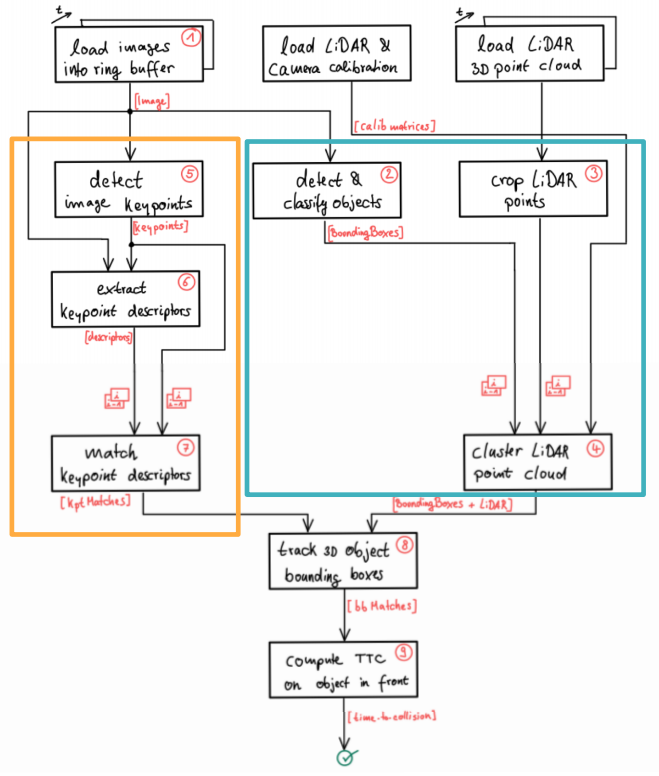
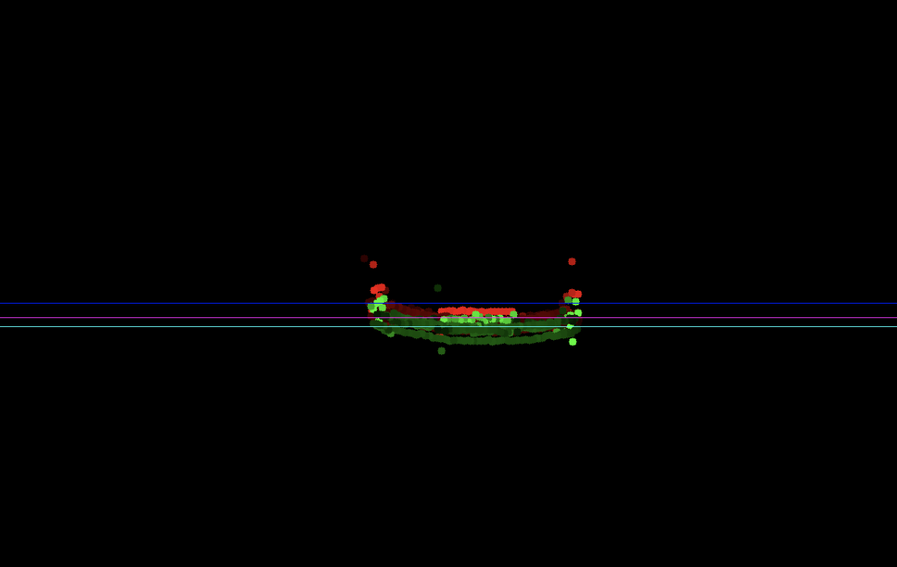
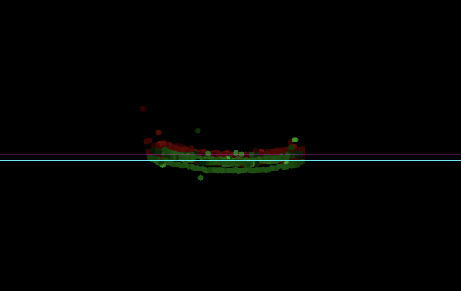
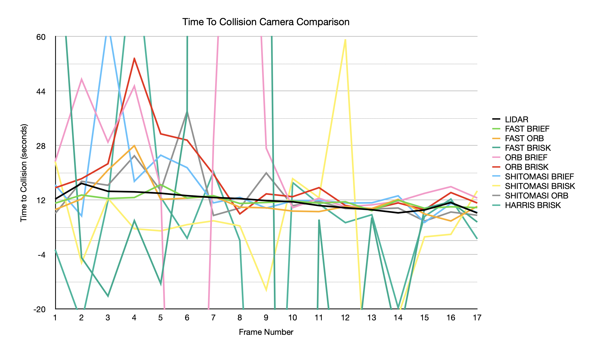
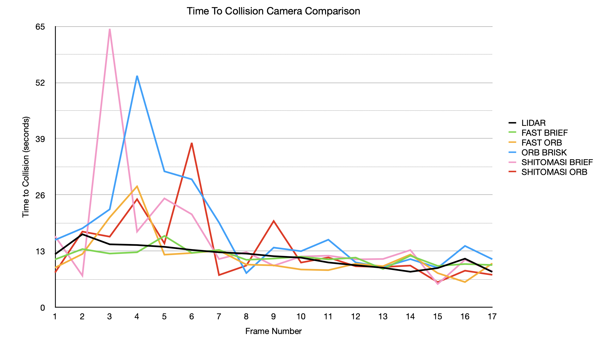
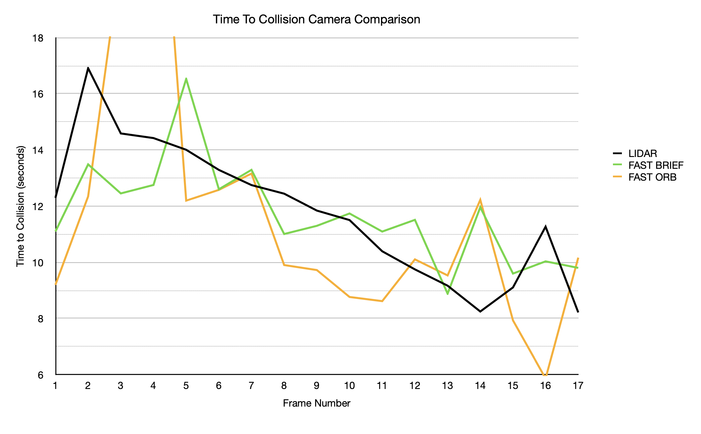

# Sensor Fusion Sensor Fusion
### 3D Object Tracking Project

<!--img src="images/system_structure.png" width="779" height="414" /-->
<!--img src="images/system_structure.png" height="400" /-->

## Overview

C++ development to build a vehicle collision detection system. This build utilises 2D camera based feature tracking developed in [2D_feature_tracking](https://github.com/nutmas/SFND_2DFeatureTracking). This project fuses together lidar and camera data points to track 3D features and thus realise 3D bounding boxes over time, which can then be used in order to establish time-to-collision(TTC) of the vehicle in front of ego vehicle. Results are evaluated using previously established best detectors and descriptor combinations.

The software architecture overview is shown:

The major tasks of this development are:

1. Match 3D objects over time using keypoint correspondences. 
2. Compute the TTC based on Lidar measurements. 
3. Using the camera data associate keypoint matches to regions of interest and compute TTC based on those matches.
4. Conduct various tests with the framework and identify the most suitable detector/descriptor combination for TTC estimation.
 

---

## Installation steps

* cmake >= 2.8
  * All OSes: [click here for installation instructions](https://cmake.org/install/)
* make >= 4.1 (Linux, Mac), 3.81 (Windows)
  * Linux: make is installed by default on most Linux distros
  * Mac: [install Xcode command line tools to get make](https://developer.apple.com/xcode/features/)
* Git LFS
  * Weight files are handled using [LFS](https://git-lfs.github.com/)
* OpenCV >= 4.1
  * This must be compiled from source using the `-D OPENCV_ENABLE_NONFREE=ON` cmake flag for testing the SIFT and SURF detectors.
  * The OpenCV 4.1.0 source code can be found [here](https://github.com/opencv/opencv/tree/4.1.0)
* gcc/g++ >= 5.4
  * Linux: gcc / g++ is installed by default on most Linux distros
  * Mac: same deal as make - [install Xcode command line tools](https://developer.apple.com/xcode/features/)

---

## Build the code

1. Access the folder created from cloning `cd SFND_3D_Object_Tracking`
2. Make a build directory: `mkdir build && cd build`
3. Compile: `cmake .. && make`

---

## Usage

1. From terminal window; change to build folder of project `cd SFND_3D_Object_Tracking/build`
2. `./3D_object_tracking`

---

## Model Documentation

### FP.1 Match 3D Objects

The function `matchBoundingBoxes` is called in:

_Lines 252-253: FinalProject_Camera.cpp_

This function implementation is contained in 

_Lines 397-471: camFusion_Student.cpp_

This function takes both the current and previous data frames and loops through the associated descriptor matches previously calculated. It checks if the matches are present in the boxed regions of interest, determines the matched pair correlation between previous and current frames and then utilises this information to associate and create a relation between the yolo generated box ID's. The best matched ID's are return as a mapped pair in the `bbBestMatches` variable;

### FP.2 Compute Lidar-based TTC

The function `computeTTCLidar` is called in:

_Lines 286: FinalProject_Camera.cpp_

This function implementation is contained in 

_Lines 374-394: camFusion_Student.cpp_

This function takes the previous frame and current frame lidar points and determines the relative distance from the ego vehicle in both time instances.
Using constant velocity model the TTC is calculated with this distance information. The calculated time is return in the variable TTC.

In order to establish the ego vehicle to vehicle in front distance, a function called `minXValue` is created. The implementation of this function is contained in: 

_Lines 334-371: camFusion_Student.cpp_

This function filters the lidar data based on height position to exclude road surface and also reject high reflectivity outliers to produce a more stable lidar data set to represent the vehicle in front. Utilising this stable dataset it finds the mean lidar point value to establish the distance to vehicle.

### FP.3 Associate Keypoint Correspondences with Bounding Boxes

The function `clusterKptMatchesWithROI` is called in:

_Lines 298: FinalProject_Camera.cpp_

This function implementation is contained in 

_Lines 136-172: camFusion_Student.cpp_

This function associates keypoint correspondences to the bounding boxes which enclose them from the camera measurements. If the keypoint falls within the region of interest, then the Euclidean distance from the previous frame to the current frame is calculated. The average distance is calculated from this keypoint set to establish a threshold for keypoint distance.
The points are processed once again but filtered using the distance threshold to filter out potential false matches. The judged keypoints and valid matches are pushed back into the data buffer.

### FP.4 Compute Camera-based TTC

The function `computeTTCCamera` is called in:

_Lines 299: FinalProject_Camera.cpp_

This function implementation is contained in 

_Lines 176-227: camFusion_Student.cpp_

Time-to-collision is computed in seconds for all matched 3D objects using only keypoint correspondences from the matched bounding boxes between current and previous frame.

### FP.5 Performance Evaluation 1

During the development and initial testing large variations could be realised on some frames. An attempt was made to arbitrate these variations to obtain a more stable result.

___

Lidar measurements would increase for a single frame example: from 13 seconds to 23 seconds then back to 13 seconds on next frame.

To investigate I plotted the lidar data using the reflectivity value to indicate brightness of the colour - red is the previous frame, green is the current. The image on the left is without filter -the bright red and green can be seen, the image on the right shows after filtering, and removing the highly reflective points.

 

These reflections could be from the mirrors or the road white lines close to the vehicle in the bounding box, by filtering out these values a more stable average of points could be calculated.

___

For the TTC calculation to increase the result stability I tried both using a median and a mean value for the points, as opposed to simply selecting the nearest point. With the Lidar data the mean produced the most stable measurements as using the median, even with a large majority of outliers removed would still produce the odd large variation in one or two frames transitions.
Even with the reflectivity and road filtering there are still the edges of the vehicle which could be captured form time to time and provide points which are not all on the same rear surface. Additioanl actions were took to arbitrate these such as reducing region size, but this is not a robust solution as if ego vehicle moves towards edge then they would be present again.

With the camera calculation the mean and median didn't vary as wildly and both produced quite similar results. 

The final outcome was to use the mean value for both camera and lidar when calculating TTC.

The mean and the median of the calculated results 

 FAST & BRIEF **TTC using Mean Lidar & Mean Camera**
| Frame | LiDAR TTC | Camera TTC | Difference |
| :---: | :---:  | :---:  | :---:  |
 | 1 | 12.935 | 11.042 | 1.893 | 
 | 2 | 12.2967 | 11.0971 | 1.19952 | 
 | 3 | 16.9097 | 13.4872 | 3.42256 | 
 | 4 | 14.5878 | 12.4537 | 2.1341 | 
 | 5 | 14.4231 | 12.754 | 1.66908 | 
 | 6 | 14.0064 | 16.5266 | -2.52013 | 
 | 7 | 13.2902 | 12.6022 | 0.688061 | 
 | 8 | 12.7502 | 13.292 | -0.541821 | 
 | 9 | 12.4447 | 11.0075 | 1.43726 | 
 | 10 | 11.841 | 11.2984 | 0.542626 | 
 | 11 | 11.5036 | 11.738 | -0.234351 | 
 | 12 | 10.3929 | 11.0943 | -0.701453 | 
 | 13 | 9.74847 | 11.511 | -1.76252 | 
 | 14 | 9.16878 | 8.88453 | 0.284247 | 
 | 15 | 8.24923 | 11.9599 | -3.71062 | 
 | 16 | 9.10631 | 9.59968 | -0.493373 | 
 | 17 | 11.2678 | 10.0338 | 1.23397 | 
 | 18 | 8.21619 | 9.80198 | -1.58579 | 

___

### FP.6 Performance Evaluation 2

Several detector / descriptor combinations were evaluated with the TTC to establish which methods perform best. In order to select the most suitable combinations to evaluate the top 10 detector, descriptor performers from the mid-term project were selected.

These results were tabled and the following chart was constructed:

This graph shows that some of the camera TTC performance has very large fluctuating results. These very noisy combinations were removed to focus on the best results:

Comparing the camera combinations to the lidar (black trace), it can be seen that most of the camera combinations have quite large fluctuations in the earlier frames and then settle and start to converge nearer to the lidar measurements.
This phenomena could be explained by the camera data finding a large amount of descriptors in the early stages and requiring a number of images to be processed to find the best matched features between frames and therefore allow a more accurate calculation of TTC.

CSV data can be found in the csv folder of this repo.

---

## Reflection

From these results it can be seen that the FAST-BRIEF performance does not wildly fluctuate at the start and has a closer correlation to the lidar data.

In the mid-term FAST-BRIEF scored the highest in terms of speed, but it had less chance of positive matches when compared with the FAST-ORB combination, which led me to recommend the FAST-ORB for collision system detection.

The results from this evaluation has shown the FAST-BRIEF combination to be a superior choice for the collision avoidance system.  

The chart below shows a closer view of the comparison between FAST-BRIEF and FAST-ORB. The Lidar trace shows a steady decrease of speed through the frames, whereas the camera still has some variation.

With the Lidar there are two spikes in its data - near to the start and near to the end. My conclusion for these two spikes is the TTC algorithm is constant velocity model, and both at the start and near the end the velocity is rapidly changing and therefore results in poor estimation of the TTC.

---

## License

For License information please see the [LICENSE](./LICENSE) file for details

---
